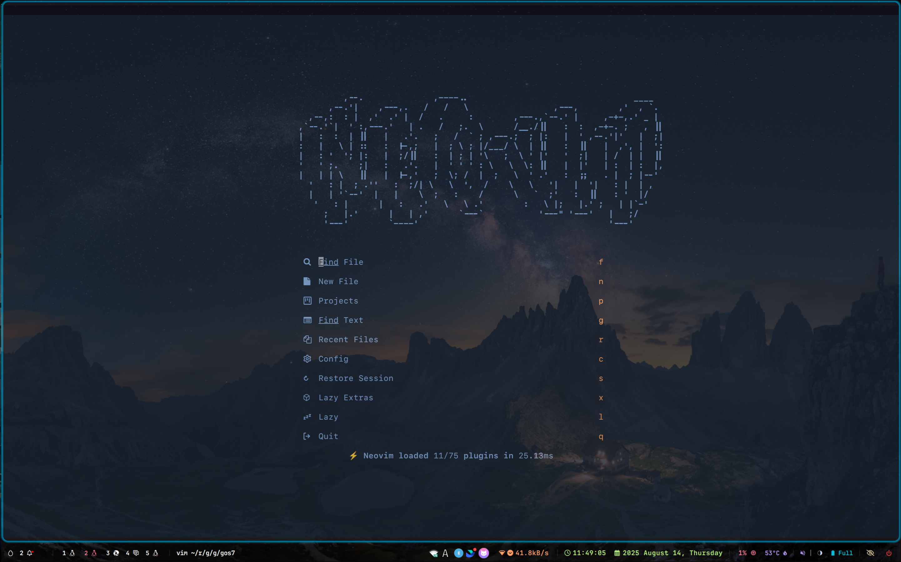
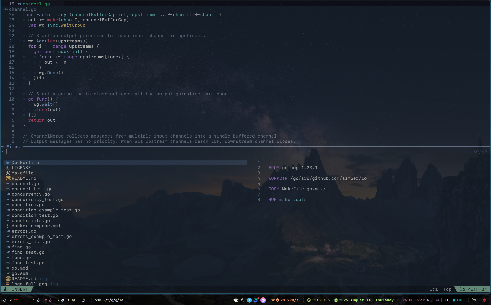
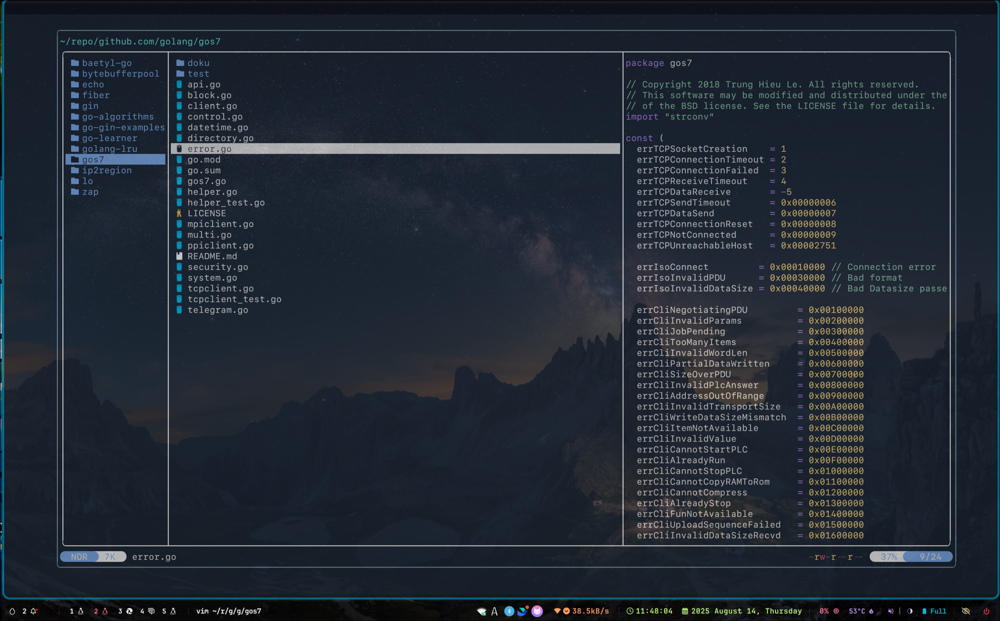
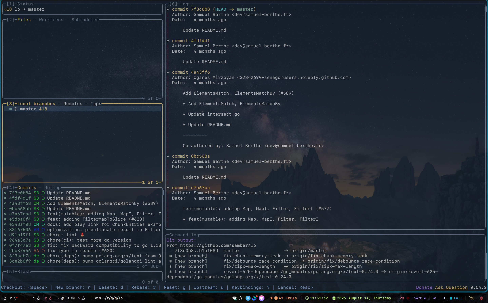

# Introduction

Personal neovim configuration，inspired by:

- [kicstart](https://github.com/nvim-lua/kickstart.nvim)
- [AstroNvim](https://github.com/AstroNvim/AstroNvim)
- [LazyNvim](https://github.com/LazyVim/LazyVim)

Support large-scale project development and debugging for Golang, Rust, and Java.

# ScreenShot

